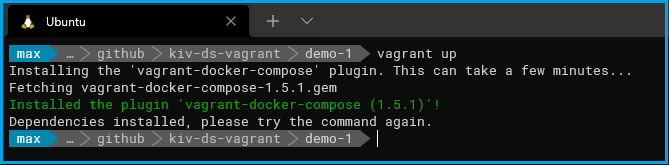
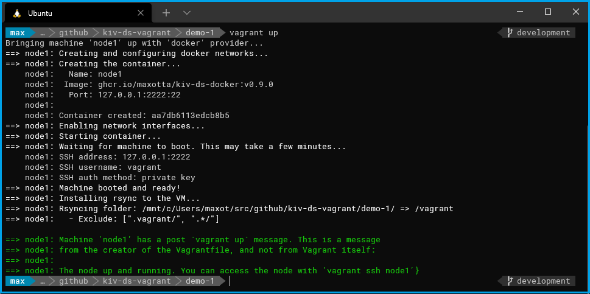
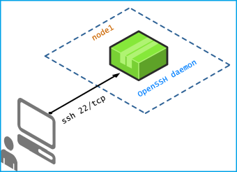
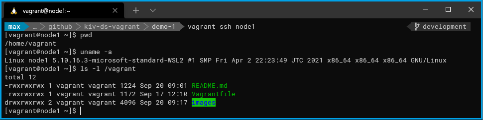

#  Demo 1

The aim of this demo is to introduce you to the Vagrant tool and how you can use it for setting up and running *"virtual machines"* on your computer. In order to be able to run it, you must follow the instructions given in the main [README.md](../README.md#installation) file.

## Running the demo

To run the demo, open the terminal (on Windows the WSL2 terminal), go to the `demo-1` directory and enter: `vagrant up`.

If you are running a demo in this repository for the very first time, the `vagrant-docker-compose` plugin will be automatically installed:

*Picture 1: The vagrant-docker-compose plugin installation* 

In that case, just repeat the `vagrant up` command and your first infrastructure will be started up:

*Picture 2: Starting the first demo*

As show on the following deployment diagram, the created and started infrastructure is very simple, consisting just of a single node:

## Deployment diagram

*Picture 3: Deployment diagram of Demo 1*

## Accessing the running node (container)

If you want to access the `node1`, just use the command `vagrant ssh node1`:

*Picture 4: Using ssh to access node1

## Managing the nodes

With **Vagrant** you can easily manage the whole instrastructure. The basic commands are:

* `vagrant up` - start the infrastructure
* `vagrant halt` - stop the infrastructure 
* `vagrant destroy` - dispose the infrastructure (and halt if running)
* `vagrant provision` - start provisioning. The provisioning is automatically started if the infrastructure is started for the first time with the `vagrant up` command.
For more read the [Vagrant command-line interface documentation](https://www.vagrantup.com/docs/cli) which is a port of the [Official Vagrant Documentation](https://www.vagrantup.com/docs).

## The Vagrantfile

The whole infrastructure is described in one file, the `Vagrantfile`. It describes what nodes are created from prefabricated (VM) images and their provisioning (software installation and configuration) and is supposed to be committed to a version control system . For detailed description of the `Vagrantfile`, please read the [Vagrantfile official documentation](https://www.vagrantup.com/docs/vagrantfile)

## Synced folders
**Synced folders** allow you to access the host system's file system from within the VM or container. Official [synced folders doc](https://www.vagrantup.com/docs/synced-folders).

## The kiv-ds-docker image

All examples/demos in this repository use the [kiv-ds-docker](https://github.com/maxotta/kiv-ds-docker) image as a base for the nodes. It's not neccesary to have a deep knowledge of Docker, but some basic knowledge will help you to better understand how the examples work.
For more information, read the [Official Docker Guides](https://docs.docker.com/get-started/overview/).

## Cleanup

 If you think you've played enough with this demo, just run the `vagrant destroy -f` command. This command stops the whole infrastructure and removes all related artifacts on your local drive (downloaded and created VM images which may occupy significant space on your drive).

---

