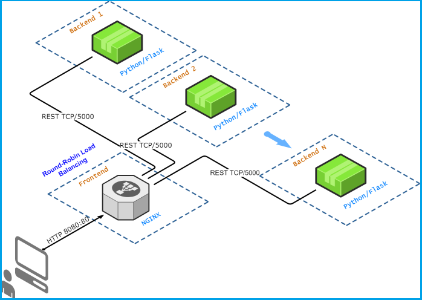
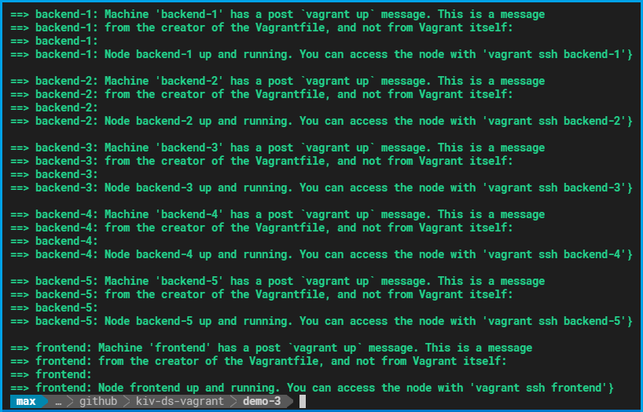
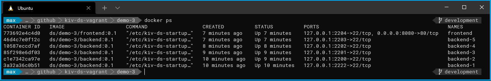
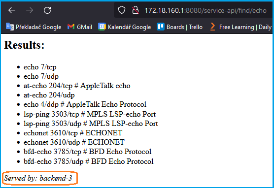

#  Demo 3

The aim of this demo is to show how to:
* create and start nodes/containers programmatically
* use [Vagrant triggers](https://www.vagrantup.com/docs/triggers)
* how to create configuration files using a [Ruby](http://rubylearning.com/satishtalim/tutorial.html) script

## Deployment diagram

*Figure 1: Deployment diagram of Demo 3*

## Running the demo

Just enter `vagrant up` in the `demo-3` directory and wait until all nodes start up:

*Figure 2: Demo 3 Startup*

With the command `docker ps` you can see what containers are currently running:

*Figure 3: Containers running in Docker*

If everything is running (frontend and N backends), you can verify how the configured round-robin load balancing in [NGINX](https://www.nginx.com/) works. Point your browser to the frontend URL [(see Demo-2 how to access the frontend)](../demo-2#accessing-the-deployed-service). You should see the same page as in Demo-2, but with a small difference: at the bottom is an information which backend served your request. As you hit the *Reload button* on your web browser, each time the request will be served by another backend in a *round robin way*:

*Figure 4: Verifying load balancing with a web browser*

 ## Cleanup

 If you think you've played enough with this demo, just run the `vagrant destroy -f` command.

---

