#  Demo 4 - Zookeeper as a standalone server

The aim of this demo is to show how to:
* Startup a single Zookeeper server
* Use the client API - shown on Python API [Kazoo](https://kazoo.readthedocs.io/en/latest/)
* Install and use the [Zookeeper navigator](https://zoonavigator.elkozmon.com/en/latest/) GUI
* Install and use the [Portainer](https://www.portainer.io/) Docker management GUI

## Deployment diagram

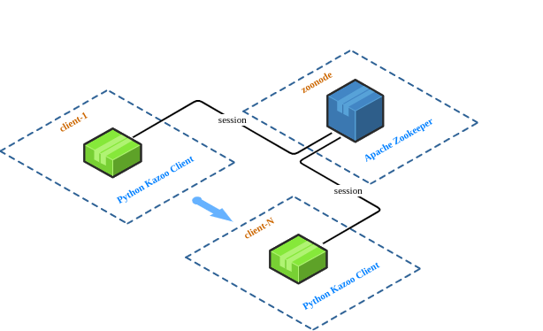

*Figure 1: Deployment diagram of Demo 4*

## Running the demo

Just enter `vagrant up` in the `demo-4` directory and wait until all nodes start up.

## Installing and using Portainer

Portainer is a lightweight management UI which allows you to easily manage your different Docker environments. Portainer is meant to be as simple to deploy as it is to use. It consists of a single container that can run on any Docker engine. Portainer allows you to manage all your Docker resources (containers, images, volumes, networks and more). It is compatible with the standalone Docker engine and with Docker Swarm mode.
For more information, see [Portainer Community Edition](https://www.portainer.io/products) and the [offical documentation](https://docs.portainer.io/v/ce-2.9/).

At first you have to create a volume for Portainer's persistent storage:
```
docker volume create portainer_data
```
and then you can start the container with the following command:
```
docker run -d -p 8000:8000 -p 9443:9443 --name portainer \
  --restart=always \
  -v /var/run/docker.sock:/var/run/docker.sock \
  -v portainer_data:/data \
  portainer/portainer-ce:latest
```
When the container is running, point your browser to https://localhost:9443 (on WSL2 you need to know the IP address of the WSL2 gateway - see [Demo-2](../demo-2#access-wsl2)) and setup the administrator account password:

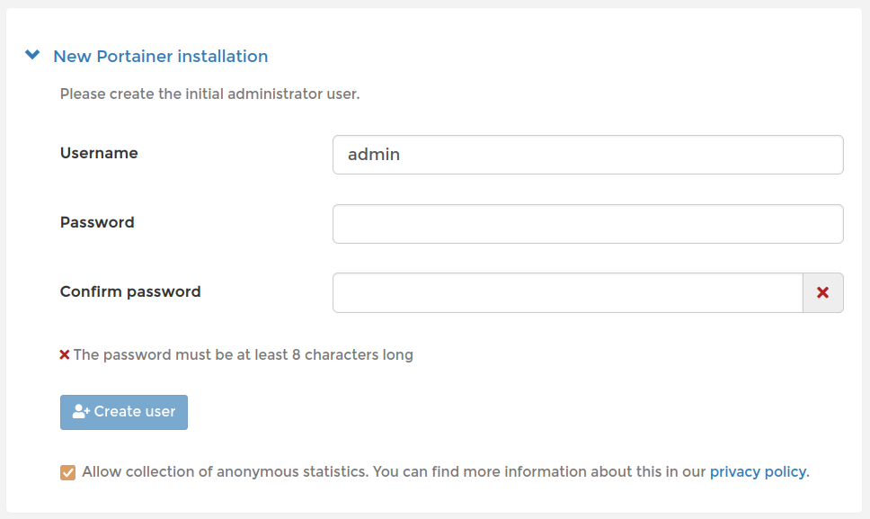

*Figure 2: Initial Portainer administrator account setup*

After the initial setup you'll land on a welcome page:

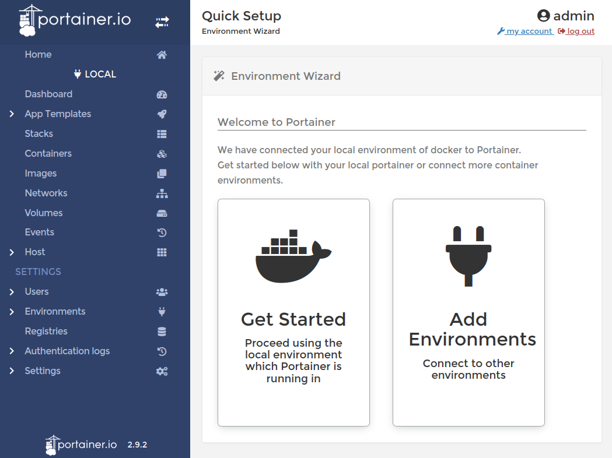

In the left vertical menu you can see all functions provided by the software, like a dashboard:

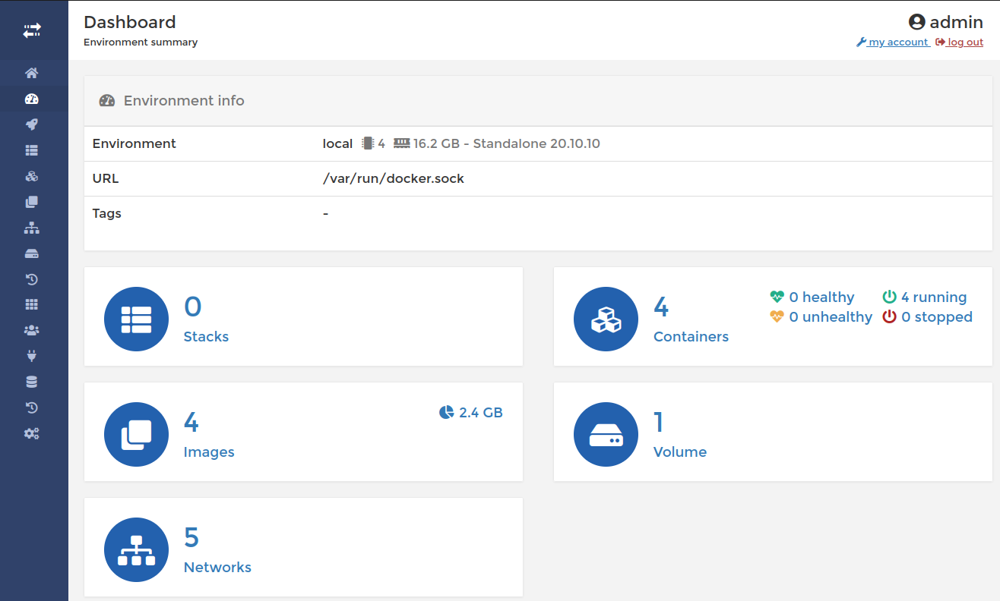

*Figure 3: Portainer dashboard*

or an overview of containers:

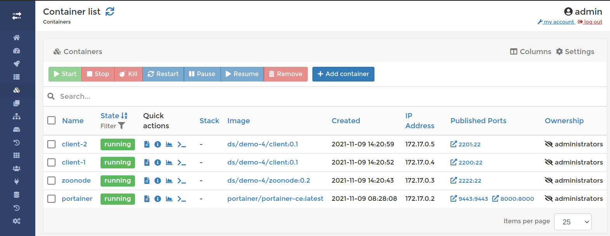

*Figure 4: Container list*

In this view you can manage the containers, read container logs and connect to a container console:

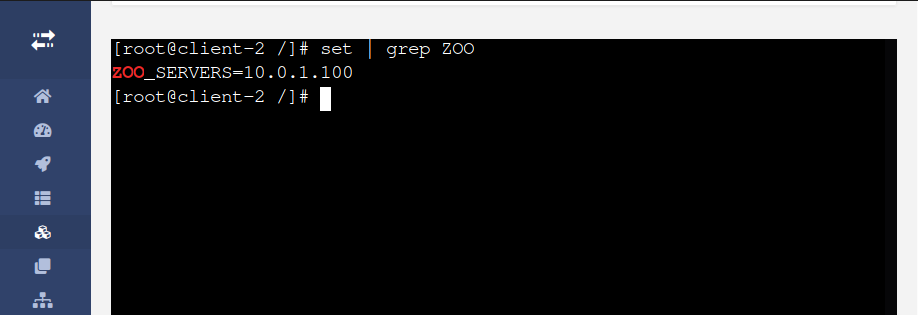

*Figure 5: Container console*

The portainer will be started automatically each time you start the Docker service.

## Installing and using Zookeper Navigator
[ZooNavigator](https://zoonavigator.elkozmon.com/en/latest/) is a web-based ZooKeeper UI and editor/browser with many features, which can be deployed also as a Docker container:

```
docker run \
  -d --network host \
  -e HTTP_PORT=9000 \
  --name zoonavigator \
  --restart unless-stopped \
  elkozmon/zoonavigator:latest
```

The Web GUI is accessible at http://localhost:9000 (in WSL2 use the gateway IP). In order to connect to a given Zookeper node, just enter it's IP address into the *Connection string* field (2181 is the default port):

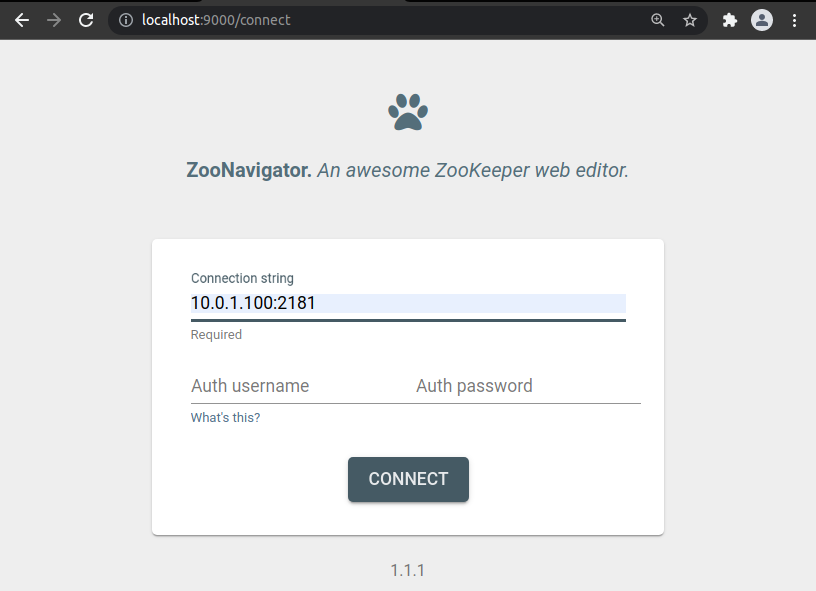

*Figure 6: Connecting to the ZooNavigator*

When you're connected, you can navigate through the hierachical data model:

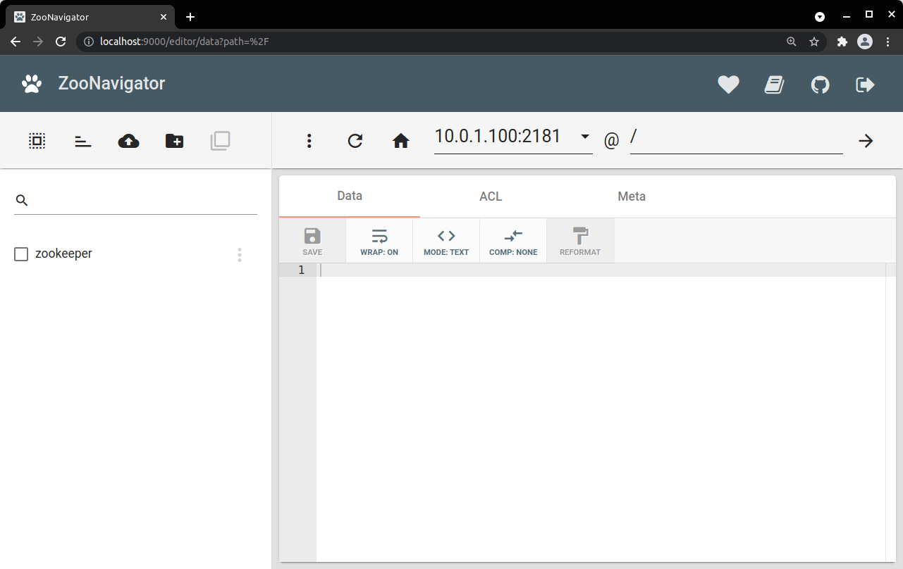

*Figure 7: Browsing the Zookeeper hierarchical data model*

## Basic Zookeeper API examples
<a name="zk-api-examples"></a>

The [provided examples](client/python) are written in the [Python programming language](https://www.python.org/) and using the [Kazoo Python Library](https://kazoo.readthedocs.io/en/latest/basic_usage.html) as an interface to the Zookeeper.

### 1. Simple access example

The [first example](client/python/zk-client-1.py) shows how to connect to a Zookeeper server (or ensemble) and get a list of child nodes of a given node.
If you run it for the first time, the node ```/ds``` doesn't exist yet and you get an exception:

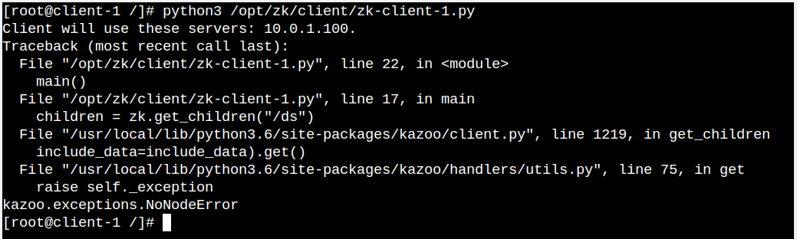

*Figure 8: The client throws a NoNodeError exception*

With ZooNavigator you can easily create the missing node:

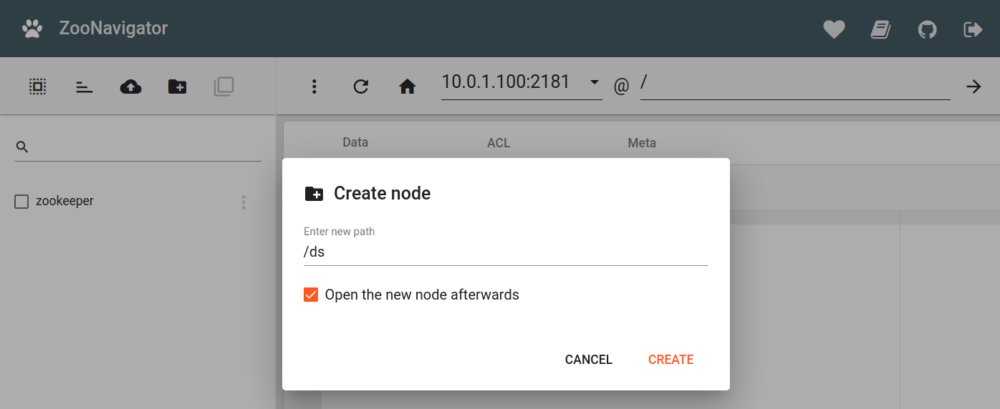

*Figure 9: Creating a new node in the ZooNavigator*

and add some child nodes:

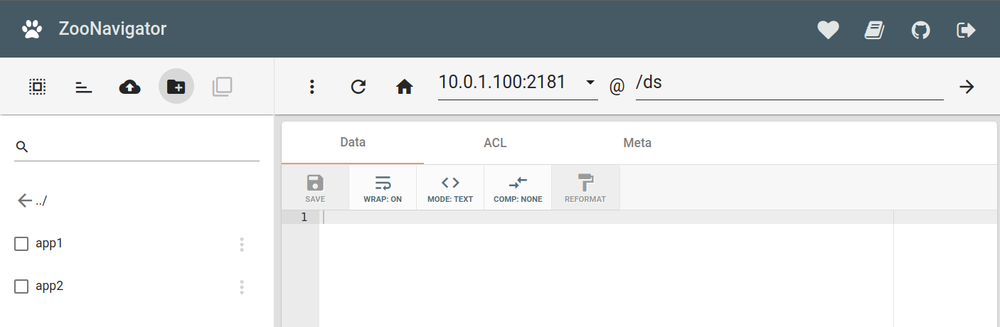

*Figure 10: A node [/ds] with two child nodes [app1] and [app2]* 

Now, if you run ```zk-client-1.py``` again, you should see the child nodes as in the listing bellow:

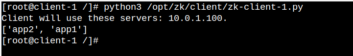

*Figure 11: The client listing the two new child nodes*

### 2. Ephemeral node demo

The second demo shows how ephemeral nodes work and how they can be used to monitor the state of client applications. Start the ```zk-client-2.py``` Python script
```
python3 /opt/zk/client/zk-client-2.py
```
from some ```client-N``` containers and watch in Zoonavigator for nodes appearing and disappearing (use 'reload') as child nodes of ```/ds/clients```:

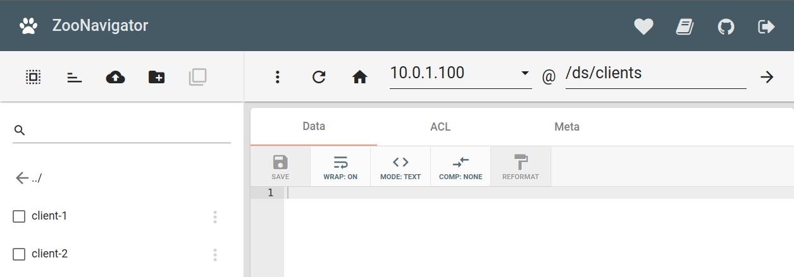

*Figure 12: Ephemeral nodes [client-1] and [client-2] in the [/ds/clients] context*

### 3. Watch events demo

All of the read operations of the Zookeeper API getData(), getChildren(), and exists() have the option of setting a watch (on the z-node passed as the function parameter) as a side effect.
A watch event is a one-time trigger, sent to the client that set the watch, which occurs when the data for which the watch was set changes.

To see how a watch is working, start on a client the ```zk-client-3.py``` script:
```
python3 /opt/zk/client/zk-client-3.py
```
The script will block for cca 5 minutes and write information on received watch notifications to the console. For notifications to take place, it is necessary to start the ```zk-client-2.py``` script on one or more client nodes. As the ephemeral nodes are created and discared, notifications are received by the ```zk-client-3.py``` script.

## Cleanup

 If you think you've played enough with this demo, just run the `vagrant destroy -f` command.

---
