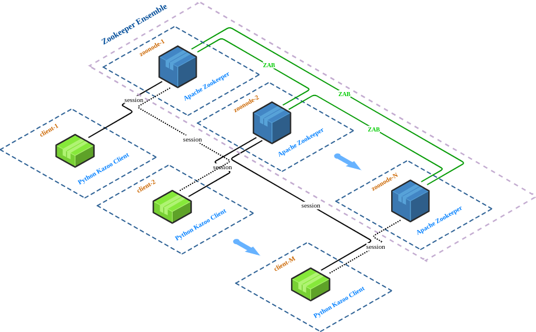

#  Demo 5 - Zookeeper ensemble

The aim of this demo is to show how to:
* TODO 1
* TODO 2
* TODO 3

## Deployment diagram

*Figure 1: Deployment diagram of Demo 5*

## Running the demo

Just enter `vagrant up` in the `demo-5-zookeeper` directory and wait until all nodes start up:

*Figure 2: Demo 5 Startup*

With the command `docker ps` you can see what containers are currently running:

*Figure 5: Containers running in Docker*

If everything is running well, .... TODO

 ## Cleanup

 If you think you've played enough with this demo, just run the `vagrant destroy -f` command.

---