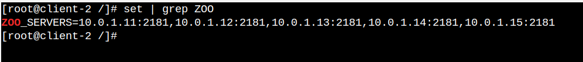

#  Demo 5 - Zookeeper ensemble

The aim of this demo is to show how to:
* Setup and start a Zookeeper servers ensemble
* How to setup a client connecting to a servers ensemble

## Deployment diagram


*Figure 1: Deployment diagram of Demo 5*

## Running the demo

Just enter `vagrant up` in the `demo-5` directory and wait until all nodes start up. The main trick of this demo is how the Zookeper enseble configuration is built. The dynamic cluster information like the unique Zookeeper server ID and member list is passed as environment variables to the ```docker-entrypoint.sh``` script which uses it to create the important configuration files like ```/opt/zk/data/myid``` with the node's unique ID and ```/opt/zk/conf/zoo.cfg``` containing basic configuration and list of all ensemble nodes.

The clients receive the list of servers forming the enseble in the environment variable ```ZOO_SERVERS``` as a comma separated list:



*Figure 2: Server list passed to a client*

## Testing the clients

You can run exactly the same example client like in [Demo-4](../demo-4), but know you can test the cluster's fault tolerance by *pausing* and *resuming* one of the ```zoonode-N``` containers.

## Cleanup

If you think you've played enough with this demo, just run the `vagrant destroy -f` command.

---