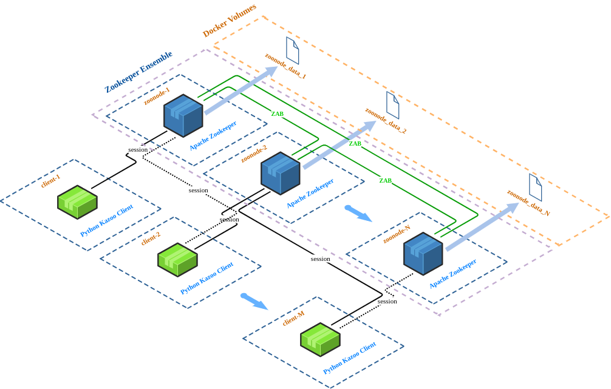
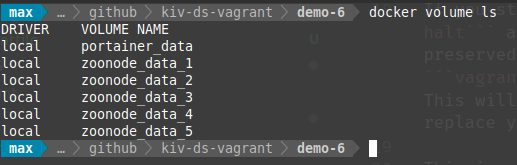

#  Demo 6 - Zookeeper ensemble with persistent storage

The aim of this demo is to show how to use Docker volumes to add persistent storage to containers.


## Deployment diagram



*Figure 1: Deployment diagram of Demo 6*

## Running the demo

Just enter `vagrant up` in the `demo-6` directory and wait until all nodes start up.

## The need for persistent storage

If you stop your Zookeeper project with ```vagrant halt``` and start it up later, then all data will be preserved. But if you destroy your containers with ```vagrant destroy```, then you will loose your data. This will happen also in the case of an upgrade - you replace your container by a new, more recent, version.

This is, where Docker ***volumes*** come into play. Docker volumes are independent of containers and if you remove a container, the mounted volume will not be destroyed and you can later mount it to another container. Volumes are managed using the Docker ```docker volume <operation>```command.

If you started already this demo, you can list the volumes with the ```docker volume ls``` command:



*Figure 2: Listing Docker volumes*

A Docker volume is mounted to a container at startup using the ```-v``` or ```--volume``` option, for example:
```
docker run .... --volume=zoonode_data_1:/opt/zk/data
```
This means, that the volume named ***zoonode_data*** will be mounted at ```/opt/zk/data``` in the container.

 ## Cleanup

 If you think you've played enough with this demo, just run the `vagrant destroy -f` command.

 If you also don't want to use the created volumes for the persistent data, you can remove them:
 ```
 docker volume rm zoonode_data_1
 ```
 

---