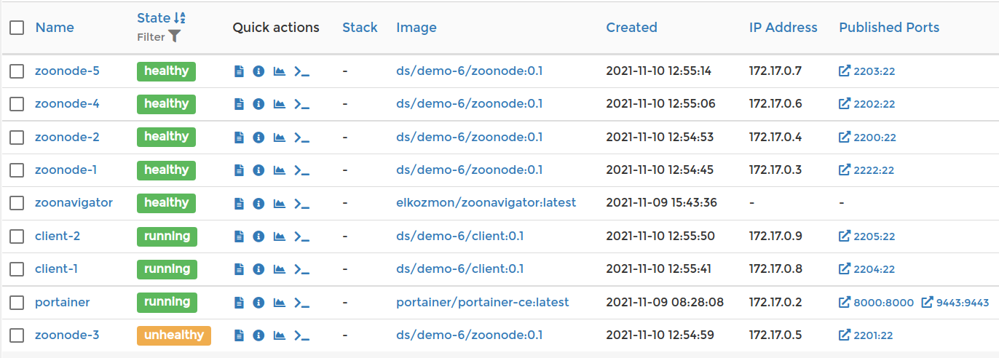

#  Demo 6 - Zookeeper ensemble with persistent storage

The aim of this demo is:
* to show how to use Docker volumes to add persistent storage to containers
* how to setup a container healthcheck

## Deployment diagram


*Figure 1: Deployment diagram of Demo 6*

## Running the demo

Just enter `vagrant up` in the `demo-6` directory and wait until all nodes start up.

## The need for persistent storage

If you stop your Zookeeper project with ```vagrant halt``` and start it up later, then all data will be preserved. But if you destroy your containers with ```vagrant destroy```, then you will loose your data. This will happen also in the case of an upgrade - if you replace your container by a new, more recent, version.

This is where Docker ***volumes*** come into play. Docker volumes are independent of containers and if you remove a container, the mounted volume will not be destroyed and you can later mount it to another container. Volumes are managed using the Docker ```docker volume <operation>```command.

If you started already this demo, you can list the volumes with the ```docker volume ls``` command:


*Figure 2: Listing Docker volumes*

A Docker volume is mounted to a container at startup using the ```-v``` or ```--volume``` option, for example:
```
docker run .... --volume=zoonode_data_1:/opt/zk/data
```
This means, that the volume named ***zoonode_data*** will be mounted at ```/opt/zk/data``` in the container.

## Container health check

If there's something wrong with your service and it crashes (the ```CMD``` command returns), then the container is stopped. But often it may happen, that the service continues to run, but is very slow or erroneous in response. For such cases, the Docker offers ***container health checks***. You define your healtcheck (usually a script) in the ```Dockerfile``` by adding a ```HEALTCHECK``` command, for example:
```
HEALTHCHECK CMD curl --fail http://localhost/api/healthcheck || exit 1
```
Docker will then automatically use your ```HEALTHCHECK``` to monitor the container's health. The command’s exit status indicates the health status of the container. The possible values are:

* ```0```: ***success*** - the container is healthy and ready for use
* ```1```: ***unhealthy*** - the container is not working correctly
* ```2```: ***reserved*** - do not use this exit code

The [```HEALTHCHECK``` command's options](https://docs.docker.com/engine/reference/builder/#healthcheck) determine how often Docker calls the health check command and determines whether the service is considered ```HEALTHY``` or ```UNHEALTHY```:

* ```--interval=DURATION``` *(default: 30s)* – Set the time between health checks. Use a higher interval to increase the time between checks. This helps if you have a low-priority service where regular health checks might impact performance. Use a more regular frequency for critical services.

* ```--timeout=DURATION``` *(default: 30s)* – Set the timeout for health check commands. Docker will treat the check as failed if the command doesn’t exit within this time frame.

* ```--start-period=DURATION``` *(default: default: 0s)* – Set the duration after a container starts when health checks should be ignored. The command will still be run but an unhealthy status won’t be counted. This gives containers time to complete startup procedures.

* ```--retries=N``` *(default: 3)* – This lets you require multiple successive failures before a container is marked as unhealthy. If a health check fails but the subsequent one passes, the container will not transition to unhealthy. It will become unhealthy after three consecutive failed checks.

 

 *Figure 3: Docker container service health check*

## Cleanup

If you think you've played enough with this demo, just run the `vagrant destroy -f` command, but the Docker volumes ill be preserved. You can can remove them with the following command:
```
docker volume rm zoonode_data_1
```

---